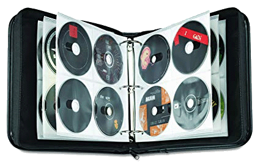
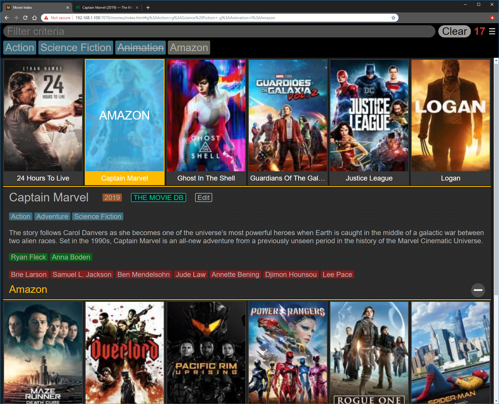
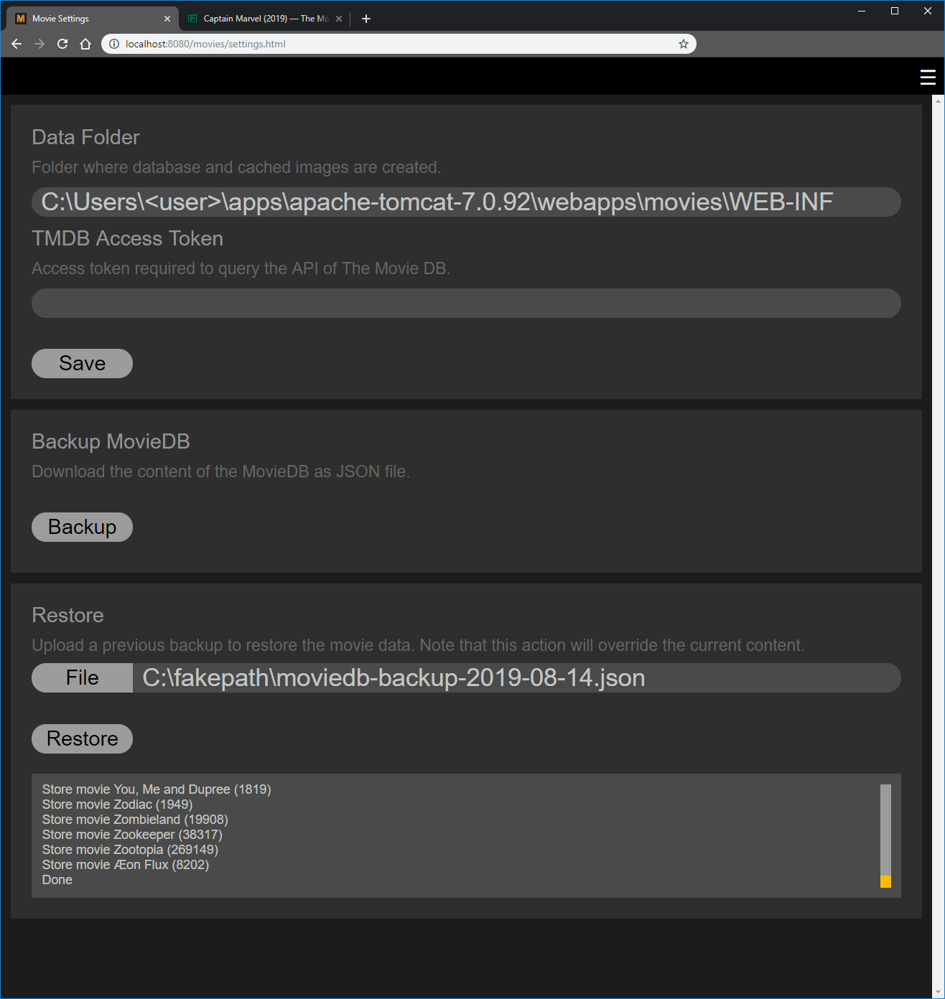
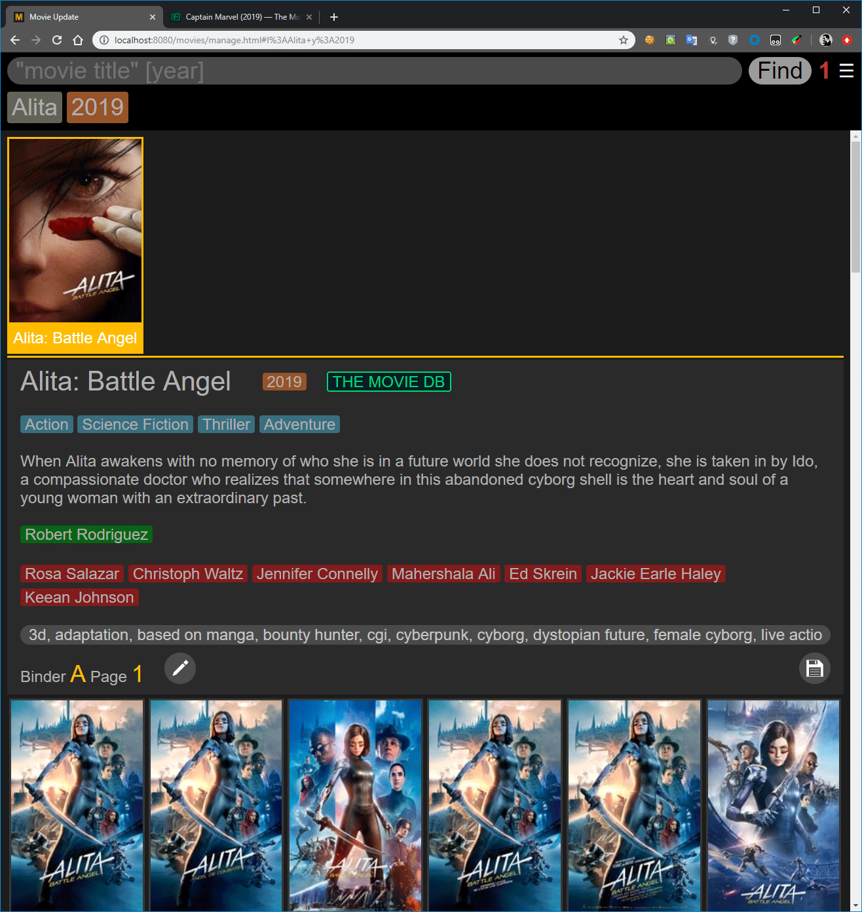

# MovieDB

I own many movies on disk and online (Amazon, Google, etc.) and all 
those disks piled up in cabinets. Finding a specific movie or a movie
we wanted to watch involved often times a lot of manual labor shifting
movie cases around.

My solution? Get a bunch of CD DVD Storage Binders. Index each binder
with a letter and each page in the binder with its page number. 

With the MovieDB software I now can easily and quickly find movies and
locate them (binder, online provider).

## Requirements
In order to search for movies you must obtain an API key from `The Movie
DB` at [http://themoviedb.org](https://www.themoviedb.org/documentation/api).
You will need to provide it in the settings page.

## Features
* iPad friendly
* Images scale based on screen size
* Easily search and fetch meta data from TMDb api
* Filter movies by title, year, genre, director, actors and keywords
* Convenient link to movie page on TMDb website (details, preview)
* Export database in JSON format (including images)

## Screenshhot

### Browser Your Movies

### Settings, Backup and Restore

### Searching TheMovieDB

