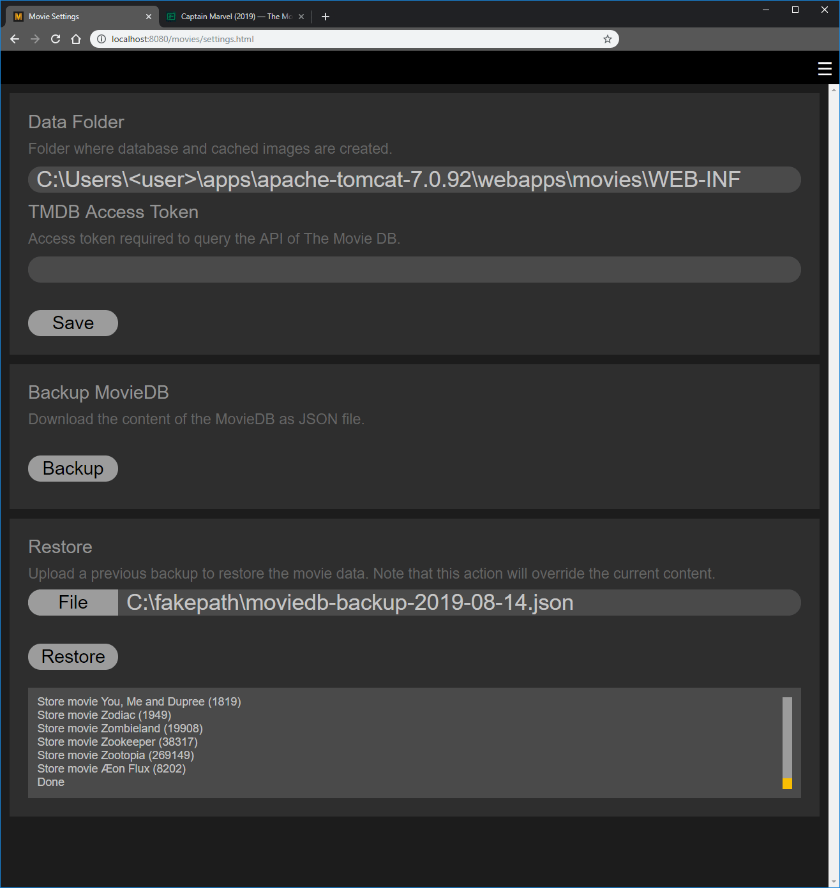

# Processing server response stream periodically on client

Restoring a backup features a live log view showing which movie is
is currently being processed. 



When using the following Ajax construct to handle the response
stream periodically via `onprogress` for the above feature, it
is important to note that when the callback is invoked,
`e.currentTarget.response` does not only return the new log data
send from the server, but all the data. The code now needs to figure
out if anything changed.

```Javascript
$.ajax({
  ...
  xhrFields: {
    onprogress: function(e) {
      // e.currentTarget.response
    }
  }
});
```

The logging therefore needs to process the response before
knowing what's new. The following is an example of how we
do it for the restore logging output, which we know is all
text based with new-line characters as delimiter.

```Javascript
var content = 'foo\nbar\nbaz\n';
var lastLineNum = 0;
var lines = content.trim().split('\n');
var linesToAdd = lines.slice(lastLineNum, lines.length);
lastLineNum = lines.length;
console.log('(call #1) Content: %s', lines.toString());
console.log('(call #1) Added: %s', linesToAdd.toString());
console.log('(call #1) Counter: %d', lastLineNum);
console.log("");

content = content + 'foo2\nbar2\nbaz2\n';
lines = content.trim().split('\n');
linesToAdd = lines.slice(lastLineNum, lines.length);
lastLineNum = lines.length;
console.log('(call #2) Content: %s', lines.toString());
console.log('(call #2) Added: %s', linesToAdd.toString());
console.log('(call #2) Counter: %d', lastLineNum);
console.log("");

content = content + 'foo3\nbar3\nbaz3\n';
lines = content.trim().split('\n');
linesToAdd = lines.slice(lastLineNum, lines.length);
lastLineNum = lines.length;
console.log('(call #3) Content: %s', lines.toString());
console.log('(call #3) Added: %s', linesToAdd.toString());
console.log('(call #3) Counter: %d', lastLineNum);
console.log("");
```
